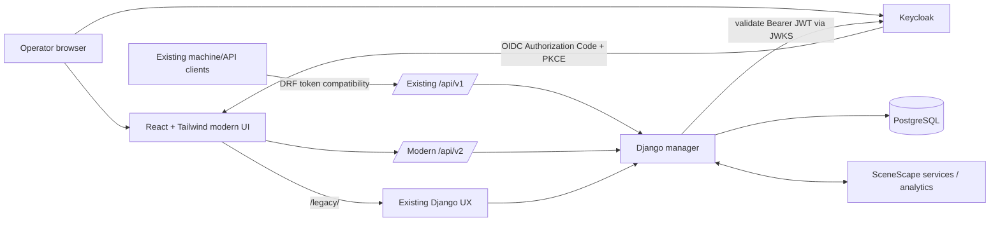

# SceneScape

[](LICENSES/Apache-2.0.txt)
[](https://github.com/open-edge-platform/scenescape)
[](https://github.com/open-edge-platform/scenescape/tree/2026.2.0)
[](modern-ui/)
[](modern-ui/keycloak/)

**SceneScape turns multimodal sensor observations into a shared spatial view of the physical world.** It provides the services, APIs and tooling needed to combine vision and other sensor inputs in a common reference frame so applications can reason about scenes, objects, regions, tripwires and spatial events rather than isolated device feeds.

This fork also contains an ongoing **operator-experience modernization of SceneScape 2026.2.0**: a React + Tailwind operations console, Keycloak-based browser identity, a modern browser API surface, and a controlled migration path that keeps the existing Django UX and `/api/v1` integrations available.

> **Modernization status**
> The modern console and identity/API bridge are implemented on this branch. Historical replay, durable incident management and time-series trend storage are UX/product targets that require additional backend services and are **not** represented as complete capabilities.

---

## Why SceneScape

Traditional sensor applications often stop at individual detections: a camera sees an object, a device publishes a location, or an analytics pipeline emits an event. SceneScape provides the spatial context needed to combine those observations into a coherent scene.

That enables applications to work with concepts such as:

- scenes and coordinate systems;
- cameras and non-visual sensors;
- tracked objects and fused observations;
- regions and tripwires;
- 2D/3D spatial visualization;
- analytics events and scene-aware application logic.

The project is a **reference architecture**, not a vertically integrated commercial product. Production deployments should integrate organization-specific identity, PKI, secrets, observability, retention, backup and security controls.

---

## Modern operations experience

The modernization follows a simple rule: **operators should work in an operations console; configuration should remain a separate control-plane activity.**

The React navigation is therefore divided into:

| Operations / data plane | Configuration / control plane |
| --- | --- |
| Shift overview | Sites, floors & scenes |
| Live scenes | Cameras |
| Incidents | Sensors |
| History & replay | Zones & tripwires |
| Trends & analytics | Administration / migration |
| Feed & service health | Django advanced editor fallback |

The new console is intentionally being introduced using a **strangler migration pattern**. Existing SceneScape models, scene processing, calibration workflows, analytics and machine-facing APIs continue to operate while browser-facing workflows are modernized progressively.

### UX direction


> The image above is a UX design artifact that defines the operator direction; it is not presented as a live runtime capture. See [Operations UX v2](docs/ux/operations-v2/README.md) for the design package and migration rationale.

---

## Architecture



### Identity and API compatibility

Browser authentication uses **Keycloak Authorization Code Flow with PKCE**. The Django manager validates Keycloak Bearer tokens using the realm's JWKS. SceneScape roles are carried in the authenticated request, including `scenescape-viewer` and `scenescape-admin`.

The migration deliberately preserves the existing integration surface:

| Interface | Purpose | Status |
| --- | --- | --- |
| `/api/v1/*` | Existing SceneScape / machine integrations using DRF token behavior | Preserved |
| `/api/v2/session` | Browser identity and capability context | Implemented |
| `/api/v2/overview` | Modern operations summary | Implemented |
| `/api/v2/scenes` | Scene inventory for the modern console | Implemented |
| `/api/v2/cameras` | Camera inventory | Implemented |
| `/api/v2/sensors` | Sensor inventory | Implemented |
| `/api/v2/regions` | Region inventory | Implemented |
| `/api/v2/tripwires` | Tripwire inventory | Implemented |
| `/legacy/*` | Existing Django UX exposed as a migration/fallback path | Retained |

This avoids forcing existing API clients to migrate simply because the browser UX changes.

---

## Capability status

| Capability | Current modernization status |
| --- | --- |
| React + Tailwind operator shell | **Implemented** |
| Light/dark operator theme | **Implemented** |
| Keycloak browser sign-in | **Implemented** |
| PKCE browser flow | **Implemented** |
| Django JWT/JWKS validation | **Implemented** |
| Existing DRF token clients | **Preserved** |
| Scene/camera/sensor/region/tripwire inventory | **Implemented through `/api/v2`** |
| Existing 2D/3D scene viewer | **Used through Django fallback during migration** |
| Advanced scene creation and calibration | **Django fallback** |
| Durable incident lifecycle and assignment | **Backend capability required** |
| Historical scene replay | **Historian/retention backend required** |
| Trend and occupancy time-series | **Historical/event store required** |
| Modern UI container and Nginx gateway | **Implemented** |
| Helm resources for modern UI and Keycloak | **Present; deployment integration must be validated for the target environment** |
| Production-grade Keycloak deployment | **Use an externally managed/production configuration; bundled configuration is for integration and evaluation** |

A missing historian or incident service is reported by the UI as **unavailable**, rather than being displayed as an empty graph or zero activity. This distinction is important for operational correctness.

---

## Repository layout

```text
scenescape/
├── modern-ui/                         # React + Tailwind operator console
│   ├── src/
│   │   ├── auth/                      # Keycloak browser session
│   │   ├── api/                       # Modern browser API client
│   │   └── App.tsx                    # Operations/control-plane UX
│   ├── keycloak/                      # Development/integration realm definition
│   ├── nginx/                         # SPA + API/legacy reverse-proxy gateway
│   └── Dockerfile
├── manager/src/manager/
│   ├── keycloak_auth.py               # Bearer JWT/JWKS authentication bridge
│   ├── modern_api.py                  # /api/v2 browser API
│   └── ...                            # Existing Django manager
├── kubernetes/scenescape-chart/       # Existing + modernization Helm resources
├── docs/
│   ├── user-guide/                    # Existing SceneScape documentation
│   └── ux/operations-v2/              # Operator UX direction and history spec
├── analytics/                         # Scene analytics services
├── autocalibration/                   # Calibration capabilities
└── tests/                             # Project test suites
```

---

## Getting started

### Existing SceneScape platform

Use the established SceneScape installation guide for the base platform:

**[Installation guide →](docs/user-guide/get-started/installation.md)**

For system architecture and concepts, start with:

**[Overview and architecture →](docs/user-guide/index.md)**

### Modern UI development

The modern frontend is isolated under `modern-ui/` and can be built independently:

```bash
cd modern-ui
npm install
npm run typecheck
npm run build
```

For interactive development:

```bash
npm run dev
```

The Vite development configuration expects the Django manager at `https://localhost:8443` for `/api` and `/legacy` proxying. Keycloak must also be reachable using the URL configured in `modern-ui/public/config.js` (or an equivalent runtime-injected configuration).

The production frontend container injects environment-specific browser configuration at startup, allowing the same built image to be used across environments without rebuilding the React bundle.

---

## Runtime configuration

The browser consumes a small runtime configuration object:

```js
window.__SCENESCAPE_CONFIG__ = {
  apiBaseUrl: '',
  keycloakUrl: '/auth',
  keycloakRealm: 'scenescape',
  keycloakClientId: 'scenescape-ui',
  legacyBaseUrl: '/legacy/',
  appTitle: 'SceneScape',
}
```

For production, use environment-specific URLs and a production Keycloak configuration. Do not treat the bundled realm/bootstrap settings as a complete security deployment.

---

## Migration principles

The modernization is designed to improve usability without destabilizing the SceneScape data and processing plane.

1. **Preserve the domain model.** Existing SceneScape models and scene semantics remain authoritative.
2. **Preserve machine interfaces.** `/api/v1` token clients continue to work.
3. **Modernize browser identity separately.** Browser sessions use Keycloak/OIDC instead of coupling the React UX to Django form authentication.
4. **Migrate workflows progressively.** The modern console becomes the default operator surface while complex authoring/calibration can fall back to Django until migrated.
5. **Do not fake missing operational data.** Historian, incident and retention capabilities must exist before their UX is represented as operational.
6. **Keep rollback practical.** The Django UX remains available during the migration period.

See **[UX and history specification](docs/ux/operations-v2/UX-AND-HISTORY-SPEC.md)** for the proposed operator model, incident lifecycle, historical coverage semantics and future backend requirements.

---

## Documentation

| Area | Documentation |
| --- | --- |
| Product / architecture | [SceneScape user guide](docs/user-guide/index.md) |
| Installation | [Getting started](docs/user-guide/get-started/installation.md) |
| REST API | [API reference](docs/user-guide/api-reference.md) |
| Modern operator UX | [Operations UX v2](docs/ux/operations-v2/README.md) |
| History / incident design | [UX and history specification](docs/ux/operations-v2/UX-AND-HISTORY-SPEC.md) |
| Testing | [Testing README](tests/README.md) |
| Contribution | [Contributing guide](CONTRIBUTING.md) |
| Security | [Security policy](SECURITY.md) |

---

## Testing

Existing project test instructions are documented in [tests/README.md](tests/README.md).

For the React frontend, the minimum static checks are:

```bash
cd modern-ui
npm run typecheck
npm run build
```

Before treating the modernization as deployment-ready, validate the complete environment: browser login/refresh/logout, Keycloak issuer and JWKS reachability, `/api/v1` compatibility, `/api/v2` authorization, Django fallback routing, Nginx proxy behavior, container health, Helm rendering and the target cluster's ingress/TLS configuration.

---

## Upstream and contribution model

This repository is based on the Open Edge Platform **SceneScape 2026.2.0** codebase. The upstream project is maintained at [open-edge-platform/scenescape](https://github.com/open-edge-platform/scenescape).

For changes intended for the upstream project, follow the upstream contribution process and [Contributing Guide](CONTRIBUTING.md). Modernization work in this fork should remain easy to review against the `2026.2.0` baseline so that domain/backend changes and UX migration changes can be evaluated independently.

---

## License

SceneScape is licensed under the [Apache License 2.0](LICENSES/Apache-2.0.txt).

---

## Disclaimers

This reference implementation focuses on functional service decomposition and API contracts. Production deployments are expected to integrate organization-specific identity, certificate, secret-management, monitoring, backup, retention and security solutions. The provided deployment examples are not intended to represent a complete production-grade security configuration.

Depending on the deployment, SceneScape may use FFmpeg and/or GStreamer. FFmpeg is licensed under LGPL/GPL depending on build and configuration; see [FFmpeg legal information](https://www.ffmpeg.org/legal.html). GStreamer is licensed under LGPL; see the [GStreamer licensing FAQ](https://gstreamer.freedesktop.org/documentation/frequently-asked-questions/licensing.html). Users are responsible for determining the licensing obligations applicable to their deployment.
