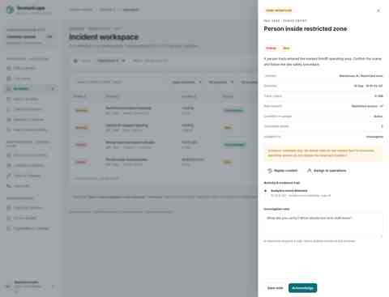
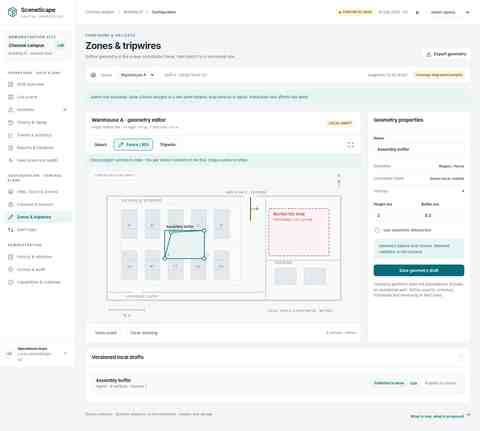

# SceneScape Operations UX v2

This directory is the UX baseline for the SceneScape modernization on `feature/react-keycloak-modern-ui`.

The direction is deliberately **operations-first**, rather than an inventory/admin-console replacement for Django. The product model separates:

- **Operations / data plane** — shift overview, live scene, incidents, history/replay, trends, handover and feed/service health.
- **Configuration / control plane** — sites/floors/scenes, cameras/sensors/calibration, regions/fences/tripwires and alert-rule publication.
- **Administration** — Keycloak-aware access, retention, audit and integrations.

Open `scenescape-operations-ux-v2.html` locally to explore the interactive synthetic-data prototype. It is a review artifact, not a deployed SceneScape runtime. It does not claim live MQTT/API connectivity, a production historian, recorded video, durable incident workflow or server-side Keycloak enforcement.

See `UX-AND-HISTORY-SPEC.md` for the proposed production architecture, especially the historical-data layer required for replay and trends.

## Screenshots

### Operations overview

### Incident investigation

### History and replay

### Configuration: zones and tripwires

## Implementation boundary

The existing SceneScape 2026.2.0 functionality must remain available while the React implementation reaches parity. In particular, native scene/map handling, camera/sensor workflows, calibration, 2D/3D visualization and spatial analytics should not disappear merely because the primary operator UX changes.

The recommended history integration consumes the release's Analytics regulated scene output plus region/tripwire events into a durable collector/store. Existing `/api/v1` compatibility should be preserved; the modernization can introduce server-authorized Keycloak-aware `/api/v2` operations endpoints.